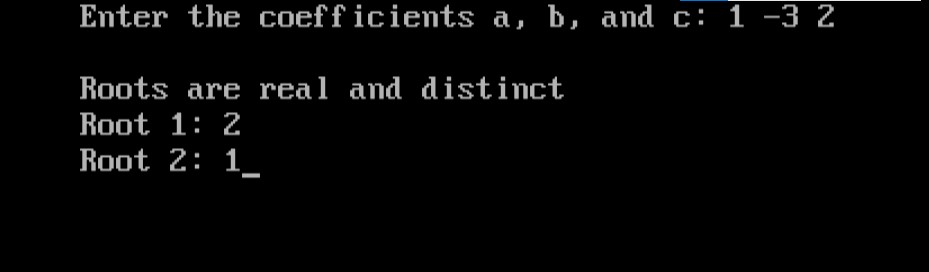
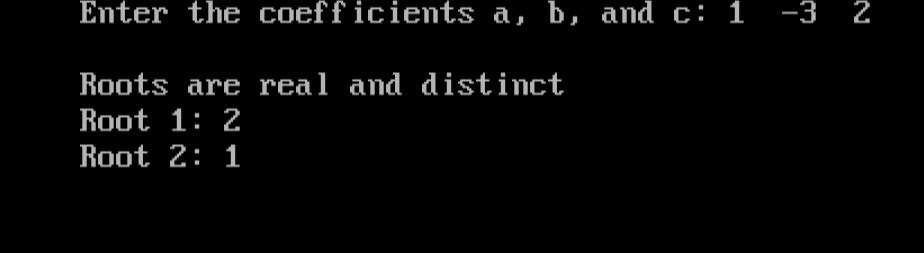
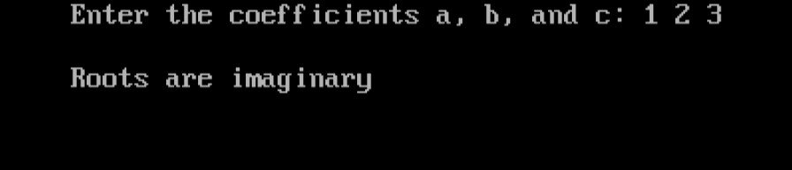

import { Callout } from "nextra/components";
import { Tabs } from "nextra/components";

# Quadratic Equation

This program solves quadratic equations of the form <span class="hinfo nx-border-blue-200 nx-bg-blue-100 nx-text-blue-900 dark:nx-border-blue-200/30 dark:nx-bg-blue-900/30 dark:nx-text-blue-200">ax<sup>2</sup> + bx + c = 0</span> , It calculates the roots of the equation based on the values of `a`, `b`, and `c` that you provide. Let's go through the code and understand how it works.

### Code Breakdown

## Algorithm

1. **Start**
2. **Input Coefficients**: Read the values of `a`, `b`, and `c`.
3. **Check if `a` is 0**:
   - If true, print "Equation is not quadratic" and exit.
4. **Calculate Discriminant `d`**:
   - Compute `d` using the formula: <span class="hinfo nx-border-blue-200 nx-bg-blue-100 nx-text-blue-900 dark:nx-border-blue-200/30 dark:nx-bg-blue-900/30 dark:nx-text-blue-200">d = b<sup>2</sup> - 4ac</span>
5. **Check Discriminant**:
   - If `d > 0`, calculate two distinct real roots:
     - `root1 = (-b + sqrt(d)) / (2 * a)`
     - `root2 = (-b - sqrt(d)) / (2 * a)`
   - If `d == 0`, calculate one real root:
     - `root1 = -b / (2 * a)`
   - If `d < 0`, the roots are imaginary.
6. **Display Results**:
   - Print the roots or state that they are imaginary.
7. **End**

## Code Explanation

<Callout type="info" emoji="//">
  denotes comments in the code, which are not executed and are not part of the
  code logic.
</Callout>

<Tabs items={['In Depth', 'Clear code','Output']} defaultIndex="0">
  <Tabs.Tab>
```c  filename="Detailed" copy showLineNumbers
#include <stdio.h>  // This header file is used for input and output functions.
#include <conio.h>  // This header file is used for console input and output functions like clrscr() and getch().
#include <math.h>   // This header file is used for mathematical functions like sqrt().

void main()
{
int a, b, c; // Declare integer variables to store the coefficients of the quadratic equation.
double root1, root2, d; // Declare variables to store the roots of the equation and the discriminant.

    clrscr();   // Clear the screen (specific to some compilers, not standard C).

    printf("Enter the coefficients a, b, and c: ");
    scanf("%d%d%d", &a, &b, &c);  // Take input for coefficients a, b, and c from the user.

    if (a == 0)
    {
        printf("\nEquation is not quadratic");  // If a is 0, it's not a quadratic equation.
        getch();  // Wait for a key press before exiting (specific to some compilers).
        return;    // Exit the program.
    }

    d = b * b - 4 * a * c;  // Calculate the discriminant (d) of the quadratic equation.

    if (d > 0)
    {
        // If the discriminant is positive, there are two distinct real roots.
        root1 = (-b + sqrt(d)) / (2 * a);  // Calculate the first root.
        root2 = (-b - sqrt(d)) / (2 * a);  // Calculate the second root.
        printf("\nRoots are real and distinct");
        printf("\nRoot 1: %g", root1);   // Print the first root.
        printf("\nRoot 2: %g", root2);   // Print the second root.
    }
    else if (d == 0)
    {
        // If the discriminant is zero, there is one real root (repeated root).
        root1 = -b / (2 * a);   // Calculate the repeated root.
        printf("\nRoots are real and equal\n");
        printf("\nRoot = %g", root1);   // Print the repeated root.
    }
    else
    {
        // If the discriminant is negative, the roots are imaginary.
        printf("\nRoots are imaginary");
    }

    getch();  // Wait for a key press before exiting (specific to some compilers).

}
```

  </Tabs.Tab>
  <Tabs.Tab>
```c filename="Plain" copy showLineNumbers
#include <stdio.h>
#include <conio.h>
#include <math.h>
void main()
{
    int a, b, c;
    double root1, root2, d;
    clrscr();
    printf("Enter the coefficients a, b, and c: ");
    scanf("%d%d%d", &a, &b, &c);
    if(a==0)
	{
		printf("\nEquation is not quadratic");
		getch();
		return;
	}
    d = b * b - 4 * a * c;
    if (d > 0)
    {
        root1 = (-b + sqrt(d)) / (2 * a);
        root2 = (-b - sqrt(d)) / (2 * a);
        printf("\nRoots are real and distinct");
        printf("\nRoot 1: %g", root1);
        printf("\nRoot 2: %g", root2);
    }
    else if (d == 0)
    {
        root1 = -b / (2 * a);
        printf("\nRoots are real and equal\n");
        printf("\nRoot = %g", root1);
    }
    else printf("\nRoots are imaginary");
    getch();
}
```
  </Tabs.Tab>
  <Tabs.Tab>
  
   
  
  </Tabs.Tab>
</Tabs>

### Example Flowchart

```plaintext
                            Start
                              |
                              V
                   Input coefficients a, b, c
                              |
                              V
                     Is a equal to 0?
                     /              \
                    /                \
                  Yes                No
                  /                    \
                 /                      \
    Print "Equation is           Calculate Discriminant
       not quadratic"               d = b^2 - 4ac
                |                             |
                |                             |
                V                             V
               End                     Is d greater than 0?
                                         /               \
                                        /                 \
                                      Yes                  No
                                      /  \                  \
                                     /    \                  \
                                    /      \             Is d equal to 0?
                                   /        \             /             \
                                  /          \           Yes            No
                                 /            \          |                \
    +----------------------------+       +------------------------+        \
    |  Calculate roots:           |      |  Calculate root:       |         \
    |  root1 = (-b + sqrt(d)) /   |      |  root1 = -b / (2 * a)  |          \
    |  (2 * a)                    |      +------------------------+           \
    |  root2 = (-b - sqrt(d)) /   |               |                            |
    |  (2 * a)                    |               |                            |
    +----------------------------+                |                            |
                |                                 |                            |
                |                                 |                            |
                V                                 V                            V
           Print roots:                     Print "Roots are            Print "Roots are
         root1 and root2                     real and equal"              imaginary"
                |                                 |                            |
                |                                 |                            |
                V                                 V                            V
               End                               End                          End
````
