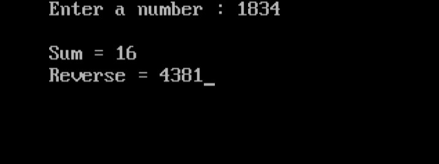

import { Tabs } from "nextra/components";

# Sum of the Digits and Reverse of a Number

This program calculates the sum of the digits and the reverse of a given number. Let's explore the code and understand its workings.

### Code Breakdown

## Algorithm

1. **Start**
2. **Input Number**: Read the value of the number.
3. **Initialize Variables**: Initialize `sum` and `reverse` to 0.
4. **Calculate Sum and Reverse**:
   - Extract each digit using modulo operation.
   - Add the digit to `sum`.
   - Construct the reverse by shifting and adding the digit.
5. **Display Results**:
   - Print the sum of the digits and the reversed number.
6. **End**

## Code Explanation

<Tabs items={['In Depth', 'Clear code','Output']} defaultIndex="0">
  <Tabs.Tab>
```c  filename="Detailed" copy showLineNumbers
#include <stdio.h>  // This header file is used for input and output functions.
#include <conio.h>  // This header file is used for console input and output functions like clrscr() and getch().

void main()
{
    int number, remainder, sum = 0, reverse = 0; // Declare variables to store the number, remainder, sum, and reverse.

    clrscr();   // Clear the screen (specific to some compilers, not standard C).

    printf("Enter a number: ");
    scanf("%d", &number);  // Take input for the number from the user.

    while (number != 0)
    {
        remainder = number % 10;  // Get the last digit of the number.
        sum = sum + remainder;    // Add the digit to the sum.
        reverse = reverse * 10 + remainder;  // Append the digit to the reverse.
        number = number / 10;     // Remove the last digit from the number.
    }

    printf("Sum of the digits: %d\n", sum);    // Print the sum of the digits.
    printf("Reversed number: %d", reverse);    // Print the reversed number.

    getch();  // Wait for a key press before exiting (specific to some compilers).
}
```
</Tabs.Tab>
<Tabs.Tab>
```c  filename="Plain" copy showLineNumbers 
#include <stdio.h>
#include <conio.h>

void main()
{
    int number, remainder, sum = 0, reverse = 0;
    clrscr();
    printf("Enter a number: ");
    scanf("%d", &number);

    while (number != 0)
    {
        remainder = number % 10;
        sum = sum + remainder;
        reverse = reverse * 10 + remainder;
        number = number / 10;
    }

    printf("Sum of the digits: %d\n", sum);
    printf("Reversed number: %d", reverse);

    getch();
}

```
</Tabs.Tab>
<Tabs.Tab>
  
</Tabs.Tab>
</Tabs>

### Example Flowchart

``` plaintext 
                                       Start
                                         |
                                         V
                                    Input number
                                         |
                                         V
                             Initialize sum, reverse to 0
                                         |
                                         V
                                Is number not equal to 0?
                                /                       \
                               /                         \
                             Yes                         No
                               |                         |
                               V                         V   
           +--------------------------------------+     End   
           | Get last digit (remainder)           |         
           | sum = sum + remainder                |          
           | reverse = reverse * 10 + remainder   |          
           | number = number / 10                 |     
           +--------------------------------------+      
                               |                             
                               V                              
                       Display sum and reverse                 
                               |                                
                               V                                 
                              End                          


```