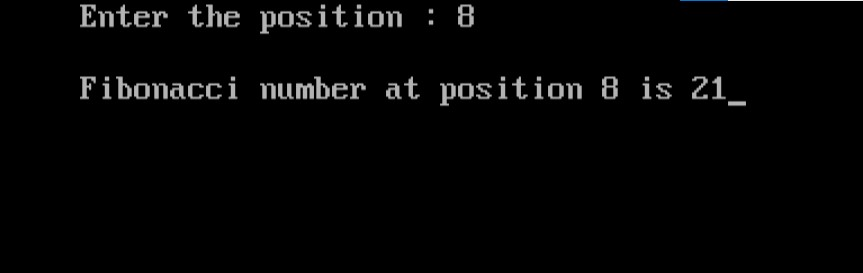

import { Tabs } from "nextra/components";

# Fibonacci Number at a Given Position

This program calculates the Fibonacci number at a specified position in the sequence. The Fibonacci sequence is a series of numbers where each number is the sum of the two preceding ones, starting from 0 and 1. This program takes a position as input and outputs the Fibonacci number at that position.


### Code Breakdown

## Algorithm

1. **Start**
2. **Input Position**: Read the value of `n` (position) from the user.
3. **Check Position**:
   - If `n < 1`, print "Invalid position" and exit.
4. **Initialize Variables**:
   - Set `a = 1`, `b = 0`, and `i = 0`.
5. **Compute Fibonacci Number**:
   - Loop until `i` is less than `n`:
     - Calculate `c = a + b`.
     - Update `a` to `b`.
     - Update `b` to `c`.
     - Increment `i`.
6. **Display Result**:
   - Print the Fibonacci number at position `n`.
7. **End**

## Code Explanation

<Tabs items={['In Depth', 'Clear code','Output']} defaultIndex="0">
  <Tabs.Tab>
```c filename="Detailed" copy showLineNumbers
#include <stdio.h>
#include <conio.h>

void main()
{
    int a, b, c, i, n; // Declare variables to store the position, Fibonacci numbers, and loop counter.
    clrscr(); // Clear the screen (specific to some compilers, not standard C).

    printf("Enter the position : ");
    scanf("%d", &n); // Take input for the position from the user.

    if (n < 1)
    {
        printf("\nInvalid position"); // Print an error message if the position is less than 1.
        getch(); // Wait for a key press before exiting (specific to some compilers).
        return; // Exit the program.
    }

    for (a = 1, b = 0, i = 0; i < n; i++)
    {
        c = a + b; // Calculate the next Fibonacci number.
        a = b;     // Update 'a' to the previous 'b'.
        b = c;     // Update 'b' to the current Fibonacci number.
    }

    printf("\nFibonacci number at position %d is %d", n, c); // Print the Fibonacci number at the given position.

    getch(); // Wait for a key press before exiting (specific to some compilers).
}

```
</Tabs.Tab>
<Tabs.Tab>
``` c filename="plain" copy showLineNumbers
#include <stdio.h>
#include <conio.h>

void main()
{
    int a, b, c, i, n;
    clrscr();
    printf("Enter the position : ");
    scanf("%d", &n);
    if (n < 1)
    {
        printf("\nInvalid position");
        getch();
        return;
    }
    for (a = 1, b = 0, i = 0; i < n; i++)
    {
        c = a + b;
        a = b;
        b = c;
    }
    printf("\nFibonacci number at position %d is %d", n, c);
    getch();
}

```
</Tabs.Tab>
<Tabs.Tab>
  
</Tabs.Tab>
</Tabs>

### Example Flowchart

``` plaintext
                                      Start
                                        |
                                        V
                              Input position n
                                        |
                                        V
                               Is n less than 1?
                              /                 \
                             /                   \
                           Yes                   No
                           /                      |
                          V                       V
               Print "Invalid position"       Initialize 
                          |               a = 1, b = 0, i = 0
                          V                       |
                         End                      |
                                                  V
                                          Loop while i < n
                                         /                \
                                        /                  \
                                       V                    V
                            Compute c = a + b         Update a = b, b = c
                                       |                     |
                                       V                     V
                               Increment i     Print Fibonacci number at position n
                                       |                     |
                                       V                     V
                                      End                   End

```