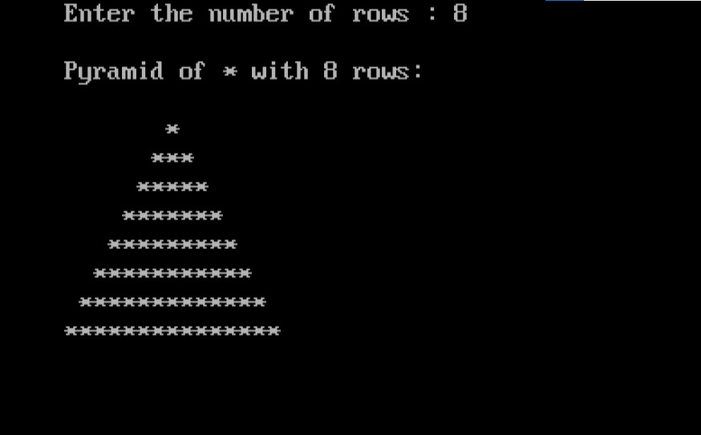

import { Tabs } from "nextra/components";

# Display a Pyramid of Stars

This program displays a pyramid pattern made of stars `*` , The number of rows in the pyramid is specified by the user. The program calculates the correct spacing and number of stars for each row to form a pyramid shape.

### Code Breakdown

## Algorithm

1. **Start**
2. **Input Number of Rows**: Read the number of rows `n` for the pyramid.
3. **Loop for Rows**: Iterate from `i = 1` to `n`:
   - **Print Leading Spaces**: Print `n - i` spaces.
   - **Print Stars**: Print `2 * i - 1` stars.
4. **Display Pyramid**: Print each row to form the pyramid.
5. **End**


## Code Explanation

<Tabs items={['In Depth', 'Clear code','Output']} defaultIndex="0">
  <Tabs.Tab>
```c filename="Detailed" copy showLineNumbers
#include <stdio.h>
#include <conio.h>

void main()
{
    int i, j, n;
    clrscr(); // Clear the screen (specific to some compilers, not standard C).

    printf("Enter the number of rows : ");
    scanf("%d", &n); // Take input for the number of rows in the pyramid.

    printf("\nPyramid of * with %d rows:\n", n);

    // Loop through each row
    for (i = 1; i <= n; i++)
    {
        printf("\n");

        // Print leading spaces
        for (j = 0; j < n - i; j++)
            printf(" ");

        // Print stars
        for (j = 0; j < 2 * i - 1; j++)
            printf("*");
    }

    getch(); // Wait for a key press before exiting (specific to some compilers).
}
```
</Tabs.Tab>
<Tabs.Tab>
``` c filename="plain" copy showLineNumbers
#include <stdio.h>
#include <conio.h>

void main()
{
    int i, j, n;
    clrscr();
    printf("Enter the number of rows : ");
    scanf("%d", &n);
    printf("\nPyramid of * with %d rows:\n", n);
    for (i = 1; i <= n; i++)
    {
        printf("\n");
        for (j = 0; j < n - i; j++)
            printf(" ");
        for (j = 0; j < 2 * i - 1; j++)
            printf("*");
    }
    getch();
}

```
</Tabs.Tab>
<Tabs.Tab>
  
</Tabs.Tab>
</Tabs>

### Example Flowchart

```plaintext
                               Start
                                 |
                                 V
                     Input number of rows (n)
                                 |
                                 V
                          Initialize i = 1
                                 |
                                 V
                        i <= n? (Check row number)
                          /                    \
                         /                      \
                       Yes                      No
                       /                          \
                      V                            V
         Print newline for each row               End
                      |
                      V
       Initialize j = 0 (for leading spaces)
                      |
                      V
       Is j < (n - i)? (Check space count)
         /                        \
        /                          \
      Yes                          No
       |                            |
       V                            V
     Print space       Initialize j = 0 (for stars)
       |                            |
       V                            V
       |           Is j < (2 * i - 1)? (Check star count)
       |               /                    \
       |              /                      \
       |            Yes                      No
       |            /                          \
       |           V                            V
       |       Print star         Initialize j = 0 (for next row)
       |           |                            |
       |           V                            V
       |           |                       Increment i
       |           |                            |
       |           V                            V
       |           V                          Repeat (Check star count)
       |           |
       V           V
      End         End

```