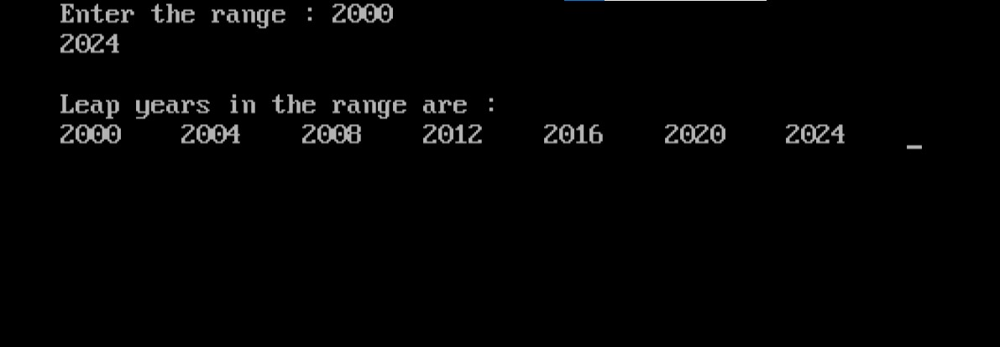

import { Tabs } from "nextra/components";

# Leap Years in a Range

This program finds and lists all leap years within a user-defined range. Leap years are those which are divisible by 4, but not by 100 unless they are also divisible by 400. The user is prompted to input a starting and ending year, and the program will display all leap years between these two values.

### Code Breakdown

## Algorithm

1. **Start**
2. **Input** the starting year and ending year.
3. **For** each year in the range from the starting year to the ending year:
   - **Check** if the year is a leap year:
     - A year is a leap year if it is divisible by 4 **and** not divisible by 100 **or** it is divisible by 400.
   - **If** the year is a leap year, **print** the year.
4. **End**

## Code Explanation

<Tabs items={['In Depth', 'Clear code','Output']} defaultIndex="0">
  <Tabs.Tab>
```c filename="Detailed" copy showLineNumbers
#include <stdio.h>
#include <conio.h>

void main()
{
    int start, end, year;

    // Clear screen (used in some environments)
    clrscr();
    
    // Prompt the user to enter the range
    printf("Enter the range : ");
    scanf("%d%d", &start, &end);

    // Print the header for the list of leap years
    printf("\nLeap years in the range are :\n");

    // Loop through each year in the range
    for (year = start; year <= end; year++)
    {
        // Check if the current year is a leap year
        if (year % 4 == 0 && year % 100 != 0 || year % 400 == 0)
            // Print the leap year
            printf("%d\t", year);
    }

    // Wait for user input before closing (used in some environments)
    getch();
}

```
</Tabs.Tab>
<Tabs.Tab>
``` c filename="plain" copy showLineNumbers
#include <stdio.h>
#include <conio.h>

void main()
{
    int start, end, year;
    clrscr();
    printf("Enter the range : ");
    scanf("%d%d", &start, &end);
    printf("\nLeap years in the range are :\n");
    for (year = start; year <= end; year++)
    {
        if (year % 4 == 0 && year % 100 != 0 || year % 400 == 0)
            printf("%d\t", year);
    }
    getch();
}

```
</Tabs.Tab>
<Tabs.Tab>
  
</Tabs.Tab>
</Tabs>

### Example Flowchart

```plaintext
                             Start
                               |
                               V
                  Input the start and end years
                               |
                               V
                +-------------------------------+
                |  For each year in the range   |
                |  (from start to end):         |
                |  - Check if the year is a     |
                |    leap year using the rules: |
                |    - Divisible by 4 AND not   |
                |      divisible by 100, OR     |
                |      divisible by 400         |
                +-------------------------------+
                               |
                               V
               Print the year if it is a leap year
                               |
                               V
                              End

```
