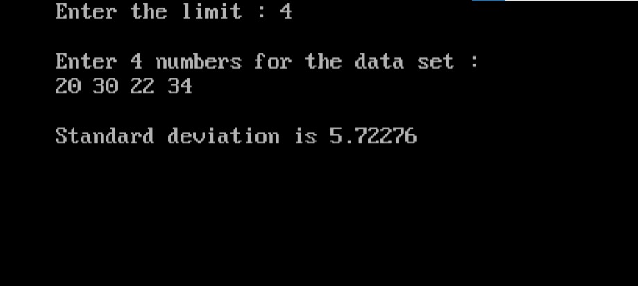

import { Tabs } from "nextra/components";

# Standard Deviation Calculation

This program calculates the standard deviation of a set of numbers, which measures the amount of variation or dispersion in the data set. To begin, the program prompts the user to enter the number of data points followed by the data itself. It then computes the mean (average) of the numbers. Using the mean, the program calculates the variance, which is the average of the squared differences between each data point and the mean. Finally, the standard deviation is determined by taking the square root of the variance. This process provides a clear indication of how spread out the data values are around the mean.


### Code Breakdown

## Algorithm

1. **Start**
2. **Input the Number of Data Points**: 
   - Prompt the user to enter the number of data points `n`.
3. **Input the Data Points**: 
   - Initialize an array to store `n` numbers.
   - Prompt the user to enter each number and store it in the array.
4. **Calculate the Mean**:
   - Initialize a variable `sum` to 0.
   - Iterate over each number in the array, adding each number to `sum`.
   - Compute the mean by dividing `sum` by `n`.
5. **Calculate the Variance**:
   - Initialize a variable `sum_of_squares` to 0.
   - Iterate over each number in the array:
     - Compute the difference between the number and the mean.
     - Square this difference and add it to `sum_of_squares`.
   - Compute the variance by dividing `sum_of_squares` by `n`.
6. **Calculate the Standard Deviation**:
   - Compute the standard deviation by taking the square root of the variance.
7. **Output the Standard Deviation**:
   - Print the standard deviation.

8. **End**


## Code Explanation

<Tabs items={['In Depth', 'Clear code','Output']} defaultIndex="0">
  <Tabs.Tab>
```c filename="Detailed" copy showLineNumbers
#include <stdio.h>
#include <conio.h>
#include <math.h>

void main() {
    int i, n;                // Declare variables for loop index and number of data points
    float x[10], sd, mean, sum; // Declare an array to store data points and variables for calculations

    clrscr();                // Clear the screen (Note: clrscr() is specific to some compilers; may need to remove or replace it)

    // Prompt the user to enter the number of data points
    printf("Enter the limit: ");
    scanf("%d", &n);        // Read the number of data points from the user

    // Check if the number of data points is within the array size
    if (n > 10) {
        printf("Number of data points exceeds the maximum allowed (10).\n");
        getch();           // Wait for user input before exiting
        return;            // Exit the program
    }

    printf("\nEnter %d numbers for the data set:\n", n);

    // Input data points and calculate the sum
    for (sum = 0, i = 0; i < n; i++) {
        scanf("%f", &x[i]);   // Read each data point into the array
        sum = sum + x[i];    // Add the data point to the sum
    }

    mean = sum / n;          // Calculate the mean (average)

    // Calculate the variance
    for (sum = 0, i = 0; i < n; i++) {
        sum = sum + (x[i] - mean) * (x[i] - mean); // Sum of squared differences from the mean
    }

    sd = sqrt(sum / n);     // Calculate the standard deviation by taking the square root of the variance

    // Output the standard deviation
    printf("\nStandard deviation is %g", sd);

    getch();                // Wait for user input before exiting
}

```
</Tabs.Tab>
<Tabs.Tab>
``` c filename="plain" copy showLineNumbers
#include <stdio.h>
#include <conio.h>
#include <math.h>

void main() {
    int i, n;
    float x[10], sd, mean, sum;

    clrscr();

    printf("Enter the limit: ");
    scanf("%d", &n);

    if (n > 10) {
        printf("Number of data points exceeds the maximum allowed (10).\n");
        getch();
        return;
    }

    printf("\nEnter %d numbers for the data set:\n", n);

    for (sum = 0, i = 0; i < n; i++) {
        scanf("%f", &x[i]);
        sum = sum + x[i];
    }

    mean = sum / n;

    for (sum = 0, i = 0; i < n; i++) {
        sum = sum + (x[i] - mean) * (x[i] - mean);
    }

    sd = sqrt(sum / n);

    printf("\nStandard deviation is %g", sd);

    getch();
}

```
</Tabs.Tab>
<Tabs.Tab>
  
</Tabs.Tab>
</Tabs>

### Example Flowchart

```plaintext
                            Start
                              |
                              V
              Input the number of data points (n)
                              |
                              V
               Input n numbers into array x[]
                              |
                              V
               Calculate the sum of all numbers
                        in array x[]
                              |
                              V
                      Calculate the mean
                       (mean = sum / n)
                              |
                              V
                      Initialize sum = 0
                              |
                              V
              For each number x[i] in array x[]
                              |
                              V
                   Compute (x[i] - mean)²
                              |
                              V
                     Add result to sum
                              |
                              V
                        End For loop
                              |
                              V
                Calculate standard deviation
                    (sd = sqrt(sum / n))
                              |
                              V
              Print the standard deviation (sd)
                              |
                              V
                             End

```
