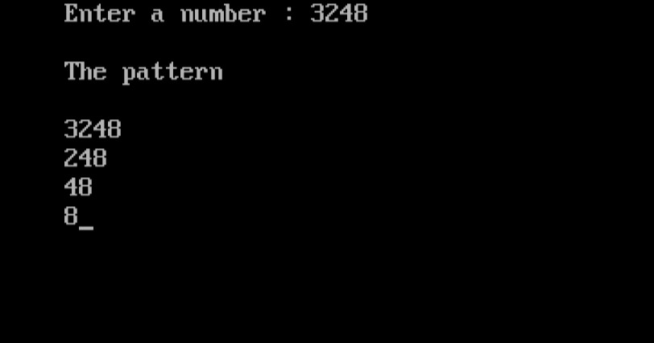

import { Tabs } from "nextra/components";

# Number Truncation Pattern

## Introduction

This program illustrates how to generate a pattern by truncating digits from a given number. The user inputs a number, and the program displays a sequence where each line presents the number with its last digit progressively removed. This is useful for understanding digit manipulation and how numbers can be decomposed sequentially.
Key steps in the program:
1. Read a number from the user.
2. Determine the largest power of 10 that is less than or equal to the number.
3. Print the number in a pattern by successively removing the last digit and displaying the result on each line.

### Code Breakdown

## Algorithm

1. **Start**
2. **Initialize Variables**:
   - `n` (user input number)
   - `l` (to store the largest power of 10 less than or equal to `n`)
   - `t` (temporary variable for processing the number)

3. **Input the Number**:
   - Prompt the user to enter a number and store it in `n`.

4. **Calculate the Largest Power of 10**:
   - Set `l` to 1.
   - While `t` (initially set to `n` divided by 10) is not 0:
     - Update `l` by multiplying it by 10.
     - Update `t` by dividing it by 10.

5. **Print the Pattern**:
   - Set `t` to `n`.
   - While `t` is not 0:
     - Print the current value of `t`.
     - Update `t` by taking `t` modulo `l`.
     - Update `l` by dividing it by 10.

6. **End**


## Code Explanation

<Tabs items={['In Depth', 'Clear code']} defaultIndex="0">
  <Tabs.Tab>
```c filename="Detailed" copy showLineNumbers
#include <stdio.h>
#include <conio.h>

void main()
{
    long n, l, t;

    // Clear the console screen
    clrscr();

    // Prompt the user to enter a number
    printf("Enter a number: ");
    scanf("%ld", &n);

    // Initialize l to 1
    l = 1;

    // Find the largest power of 10 less than or equal to n
    for (t = n / 10; t != 0; t /= 10)
    {
        l *= 10; // Multiply l by 10
    }

    // Print the pattern
    printf("\nThe pattern\n");

    // Set t to the original number n
    for (t = n; t != 0; t %= l, l /= 10)
    {
        // Print the current value of t
        printf("\n%ld", t);
    }

    // Wait for user input before closing the program
    getch();
}

```
</Tabs.Tab>
<Tabs.Tab>
``` c filename="plain" copy showLineNumbers
#include <stdio.h>
#include <conio.h>

void main()
{
    long n, l, t;

    clrscr();
    printf("Enter a number: ");
    scanf("%ld", &n);

    l = 1;
    for (t = n / 10; t != 0; t /= 10)
    {
        l *= 10;
    }

    printf("\nThe pattern\n");

    for (t = n; t != 0; t %= l, l /= 10)
    {
        printf("\n%ld", t);
    }

    getch();
}

```
</Tabs.Tab>
<Tabs.Tab>
  
</Tabs.Tab>
</Tabs>

### Example Flowchart

```plaintext
                            Start
                              |
                              V
                     Input the number `n`
                              |
                              V
                Initialize `l` to 1 and `t` to `n`
                              |
                              V
     Calculate the largest power of 10 less than or equal to `n`
         (While `t` != 0: `t = n / 10` and `l = l * 10`)
                              |
                              V
                      Print "The pattern"
                              |
                              V
              +------------------------------+
              |        While `t` != 0:       |
              |  +------------------------+  |
              |  | Print `t`              |  |
              |  | Update `t` to `t % l`  |  |
              |  | Update `l` to `l / 10` |  |
              |  +------------------------+  |
              +------------------------------+
                              |
                              V
                             End

```
