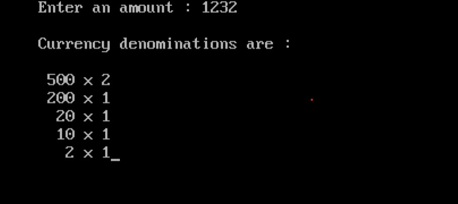

import { Tabs } from "nextra/components";

# Currency Denomination

In this program, we calculate the minimum number of currency notes required to make a given amount. The denominations used are 2000, 500, 200, 100, 50, 20, 10, 5, 2, and 1. The program takes an amount as input and determines how many of each denomination are needed to reach that amount.

### Code Breakdown

## Algorithm

1. **Step Start**: Initialize the Array of Denominations
   - Define an array `notes[]` with the currency denominations in descending order.
2. **Input the Amount**:
   - Prompt the user to enter the amount to be converted into currency denominations.
3. **Process Each Denomination**:
   - **For each denomination in `notes[]`:**
     - **Check if the Denomination is Usable**:
       - Determine if the current denomination can be used by checking if `amt / notes[i]` is greater than 0.
     - **Print the Number of Notes**:
       - Display how many notes of this denomination are needed.
     - **Update the Remaining Amount**:
       - Calculate the new amount by taking the remainder (`amt % notes[i]`).

4. **Repeat**: Continue the process until the amount is reduced to 0.
5. **Step End**: Finish the process when the entire amount has been broken down into denominations and displayed.

## Code Explanation

<Tabs items={['In Depth', 'Clear code','Output']} defaultIndex="0">
  <Tabs.Tab>
```c filename="Detailed" copy showLineNumbers
#include <stdio.h>
#include <conio.h>

void main() {
    // Array to store currency denominations in descending order
    int notes[] = {2000, 500, 200, 100, 50, 20, 10, 5, 2, 1};
    int amt, i;

    clrscr(); // Clear the screen

    // Prompt user to enter the amount
    printf("Enter an amount: ");
    scanf("%d", &amt);

    // Print header for currency denominations
    printf("\nCurrency denominations are:\n");

    // Loop through each denomination
    for (i = 0; amt != 0; i++) {
        // Check if the current denomination can be used
        if (amt / notes[i] != 0) {
            // Print the number of notes of the current denomination
            printf("\n%4d x %d", notes[i], amt / notes[i]);
            // Update the remaining amount
            amt = amt % notes[i];
        }
    }

    getch(); // Wait for user input before closing
}

```
</Tabs.Tab>
<Tabs.Tab>
``` c filename="plain" copy showLineNumbers
#include <stdio.h>
#include <conio.h>

void main() {
    int notes[] = {2000, 500, 200, 100, 50, 20, 10, 5, 2, 1};
    int amt, i;

    clrscr();
    printf("Enter an amount: ");
    scanf("%d", &amt);
    printf("\nCurrency denominations are:\n");

    for (i = 0; amt != 0; i++) {
        if (amt / notes[i] != 0) {
            printf("\n%4d x %d", notes[i], amt / notes[i]);
            amt = amt % notes[i];
        }
    }

    getch();
}

```
</Tabs.Tab>
<Tabs.Tab>
  
</Tabs.Tab>
</Tabs>

### Example Flowchart

```plaintext
                                Start
                                  |
                                  V
                         Enter an amount (amt)
                                  |
                                  V
             Initialize currency denominations (notes[])
                                  |
                                  V
                        Is amt > 0?
                       /          \
                      /            \
                    Yes             \
                     |               \
                     V                \
          Is amt >= notes[i]?          V 
          /           \               End  
         /             \               
       Yes              No             
        |               |              
        V               V              
  Print notes[i]       End              
   x amt/notes[i]                   
        |                             
        V                             
  Update amt to                     
  amt % notes[i]                    
        |                             
        V                             
  Increment i to i+1                
        |                             
        V                             
   Loop back to                   
    Is amt > 0?                       
                                    
                                  
                                  
                                  
                                  
                                  
                                

```
