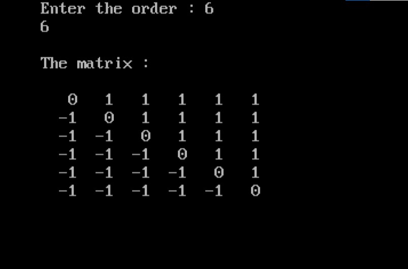

import { Tabs } from "nextra/components";

# Matrix with Specific Values

This program creates and displays a square matrix with specific values based on the relative positions of the elements. For each element in the matrix, the value is determined by comparing its row index and column index. Specifically, elements where the row index is less than the column index are assigned the value `1`, elements where the row index is greater than the column index are assigned `-1`, and elements where the row index equals the column index are assigned `0`. The matrix is first filled according to these rules and then displayed to the user.


### Code Breakdown

## Algorithm

1. **Start**
2. **Initialize Variables**: Define matrix `a[10][10]`, and variables `i`, `j`, `m`, and `n`.
3. **Input Matrix Order**: Prompt the user to enter the number of rows `m` and columns `n` (ensure it's a square matrix).
4. **Fill Matrix**:
    - For each element in the matrix:
        - If the row index `i` is less than the column index `j`, set `a[i][j]` to `1`.
        - If the row index `i` is greater than the column index `j`, set `a[i][j]` to `-1`.
        - If the row index `i` equals the column index `j`, set `a[i][j]` to `0`.
5. **Display Matrix**: Print the matrix row by row.
6. **End**

## Code Explanation

<Tabs items={['In Depth', 'Clear code','Output']} defaultIndex="0">
  <Tabs.Tab>
```c filename="Detailed" copy showLineNumbers
#include <stdio.h>
#include <conio.h>

void main() {
    int a[10][10], i, j, m, n;
    
    clrscr();  // Clear the console screen

    // Prompt the user to enter the order (number of rows and columns) of the matrix
    printf("Enter the order: ");
    scanf("%d%d", &m, &n);  // Read the number of rows (m) and columns (n)

    // Ensure that the matrix is square
    // Fill the matrix based on the given conditions
    for (i = 0; i < m; i++) {
        for (j = 0; j < n; j++) {
            // If row index is less than column index, set element to 1
            if (i < j)
                a[i][j] = 1;
            // If row index is greater than column index, set element to -1
            else if (i > j)
                a[i][j] = -1;
            // If row index equals column index, set element to 0
            else
                a[i][j] = 0;
        }
    }

    // Print the matrix
    printf("\nThe matrix:\n");
    for (i = 0; i < m; i++) {
        printf("\n");  // Move to the next line for each row
        for (j = 0; j < n; j++) {
            // Print each element with a width of 4 spaces
            printf("%4d", a[i][j]);
        }
    }

    getch();  // Wait for a key press to close the console window
}

```
</Tabs.Tab>
<Tabs.Tab>
``` c filename="plain" copy showLineNumbers
#include <stdio.h>
#include <conio.h>

void main() {
    int a[10][10], i, j, m, n;
    
    clrscr();
    printf("Enter the order: ");
    scanf("%d%d", &m, &n);

    for (i = 0; i < m; i++) {
        for (j = 0; j < n; j++) {
            if (i < j)
                a[i][j] = 1;
            else if (i > j)
                a[i][j] = -1;
            else
                a[i][j] = 0;
        }
    }

    printf("\nThe matrix:\n");
    for (i = 0; i < m; i++) {
        printf("\n");
        for (j = 0; j < n; j++) {
            printf("%4d", a[i][j]);
        }
    }

    getch();
}

```
</Tabs.Tab>
<Tabs.Tab>
  
</Tabs.Tab>
</Tabs>

### Example Flowchart

```plaintext
+-------------------------+
| Start                   |
+-------------------------+
            |
            v
+-------------------------+
| Clear the screen        |
+-------------------------+
            |
            v
+-------------------------+
| Prompt for matrix order |
| (rows m, columns n)     |
+-------------------------+
            |
            v
+-------------------------+
| Read m and n            |
+-------------------------+
            |
            v
+-------------------------+
| Initialize i = 0        |
+-------------------------+
            |
            v
+-------------------------+
| i < m ?                 |
+-----------+-------------+
            | Yes
            v
+-------------------------+
| Initialize j = 0        |
+-------------------------+
            |
            v
+-------------------------+
| j < n ?                 |
+-----------+-------------+
            | Yes
            v
+-------------------------+
| i < j ?                 |
+-----------+-------------+
            | Yes
            v
+-------------------------+
| a[i][j] = 1             |
+-------------------------+
            |
            v
+-------------------------+
| i > j ?                 |
+-----------+-------------+
            | Yes
            v
+-------------------------+
| a[i][j] = -1            |
+-------------------------+
            |
            v
+-------------------------+
| Else                    |
+-------------------------+
| a[i][j] = 0             |
+-------------------------+
            |
            v
+-------------------------+
| Increment j             |
+-------------------------+
            |
            v
+-------------------------+
| j < n ?                 |
+-----------+-------------+
            | No
            v
+-------------------------+
| Increment i             |
+-------------------------+
            |
            v
+-------------------------+
| i < m ?                 |
+-----------+-------------+
            | No
            v
+-------------------------+
| Print matrix            |
+-------------------------+
            |
            v
+-------------------------+
| End                     |
+-------------------------+

```
