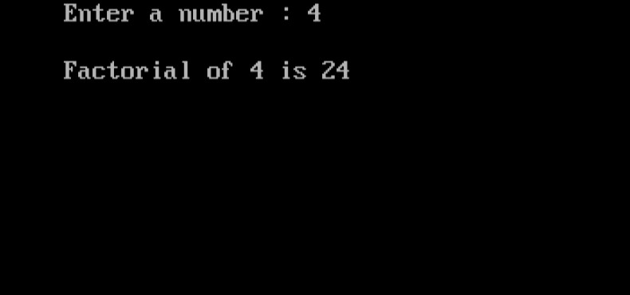

import { Tabs } from "nextra/components";

# Calculating Factorial Using Recursion

This program demonstrates how to calculate the factorial of a number using recursion. Factorials are a fundamental concept in mathematics, often used in combinatorics and algebra. The factorial of a non-negative integer \( n \) is the product of all positive integers less than or equal to \( n \). For example, the factorial of 5 (denoted as 5!) is \( 5 \times 4 \times 3 \times 2 \times 1 = 120 \).
In this program, the factorial function is implemented recursively, meaning that the function calls itself to perform the calculation. This approach is elegant and concise, but it is important to handle base cases correctly to avoid infinite recursion.


### Code Breakdown

## Algorithm

1. **Start**
2. **Input**: Read the integer `x` from the user.
3. **Call the Recursive Function**: Call the function `factorial(x)` to calculate the factorial of `x`.
   - **Function `factorial(n)`**:
     1. **Base Case**: If `n` is 0, return 1. This is because \(0! = 1\) by definition.
     2. **Recursive Case**: If `n` is greater than 0, return `n` multiplied by the result of `factorial(n-1)`. This breaks down the problem into smaller instances.
4. **Output**: Print the result of the factorial calculation.
5. **End**


## Code Explanation

<Tabs items={['In Depth', 'Clear code','Output']} defaultIndex="0">
  <Tabs.Tab>
```c filename="Detailed" copy showLineNumbers
#include <stdio.h>
#include <conio.h>

// Function prototype for calculating factorial
long factorial(int n);

void main() {
    int x; // Variable to store the user input for which factorial will be calculated

    clrscr(); // Clear the console screen (Note: clrscr() is specific to some compilers, e.g., Turbo C)

    // Prompt the user to enter a number
    printf("Enter a number: ");
    scanf("%d", &x); // Read the input number from the user

    // Calculate the factorial of the entered number and print the result
    printf("\nFactorial of %d is %ld", x, factorial(x));

    getch(); // Wait for user input before closing (Note: getch() is specific to some compilers, e.g., Turbo C)
}

// Recursive function to calculate the factorial of a number
long factorial(int n) {
    // Base case: factorial of 0 is 1
    if (n == 0) {
        return 1;
    } else {
        // Recursive case: n * factorial of (n-1)
        return n * factorial(n - 1);
    }
}

```
</Tabs.Tab>
<Tabs.Tab>
``` c filename="plain" copy showLineNumbers
#include <stdio.h>
#include <conio.h>

long factorial(int n);

void main() {
    int x;

    clrscr();

    printf("Enter a number: ");
    scanf("%d", &x);

    printf("\nFactorial of %d is %ld", x, factorial(x));

    getch();
}

long factorial(int n) {
    if (n == 0) return 1;
    else return n * factorial(n - 1);
}

```
</Tabs.Tab>
<Tabs.Tab>
  
</Tabs.Tab>
</Tabs>

### Example Flowchart

```plaintext
+----------------------------------+
|           Start                  |
+----------------------------------+
                |
                v
+----------------------------------+
|   Input number 'n'               |
+----------------------------------+
                |
                v
+----------------------------------+
| Is 'n' equal to 0?               |
+----------------------------------+
      |             |
      | Yes         | No
      v             |
+----------------------------------+
| Return 1 (Factorial of 0)        |
+----------------------------------+
                |
                v
+----------------------------------+
| Calculate 'n * factorial(n-1)'   |
+----------------------------------+
                |
                v
+----------------------------------+
| Return the result                |
+----------------------------------+
                |
                v
+----------------------------------+
|           End                    |
+----------------------------------+

```
