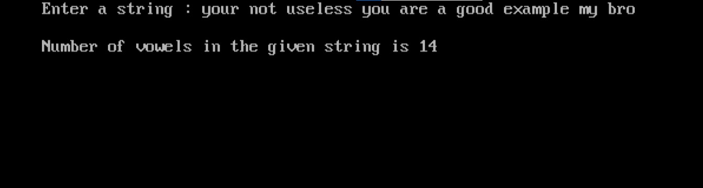

import { Tabs } from "nextra/components";

# Counting Vowels in a String

This program reads a string from the user and counts the number of vowels in that string. It handles both uppercase and lowercase vowels. The goal is to help you understand how to process strings and count specific characters using simple control structures in C.


### Code Breakdown

## Algorithm

1. Start
2. Initialize a counter for vowels (`n`) to 0.
3. Read the string input from the user.
4. Iterate through each character of the string:
   - Check if the character is a vowel (`a, e, i, o, u` in both uppercase and lowercase).
   - If it is a vowel, increment the counter (`n`).
5. Print the number of vowels counted.
6. End
## Code Explanation

<Tabs items={['In Depth', 'Clear code','Output']} defaultIndex="0">
  <Tabs.Tab>
```c filename="Detailed" copy showLineNumbers
#include<stdio.h>
#include<conio.h>

void main()
{
    char str[30];   // Array to store the input string
    int i, n;       // Variable for loop index and vowel count
    clrscr();       // Clear the console screen

    // Prompt the user to enter a string
    printf("Enter a string : ");
    gets(str);      // Read the string input from the user

    n = 0;          // Initialize the vowel count to 0

    // Iterate through each character of the string
    for(i = 0; str[i] != '\0'; i++)
    {
        // Check if the current character is a vowel
        switch(str[i])
        {
            case 'a':
            case 'A':
            case 'e':
            case 'E':
            case 'i':
            case 'I':
            case 'o':
            case 'O':
            case 'u':
            case 'U':
                n++; // Increment the vowel count
                break; // Exit the switch statement
        }
    }

    // Print the number of vowels found in the string
    printf("\nNumber of vowels in the given string is %d", n);
    getch(); // Wait for user input before closing the console
}

```
</Tabs.Tab>
<Tabs.Tab>
``` c filename="plain" copy showLineNumbers
#include<stdio.h>
#include<conio.h>

void main()
{
    char str[30];
    int i, n;
    clrscr();
    printf("Enter a string : ");
    gets(str);
    n = 0;
    for(i = 0; str[i] != '\0'; i++)
    {
        switch(str[i])
        {
            case 'a':
            case 'A':
            case 'e':
            case 'E':
            case 'i':
            case 'I':
            case 'o':
            case 'O':
            case 'u':
            case 'U':
                n++;
                break;
        }
    }
    printf("\nNumber of vowels in the given string is %d", n);
    getch();
}

```
</Tabs.Tab>
<Tabs.Tab>
  
</Tabs.Tab>
</Tabs>

### Example Flowchart

```plaintext
            Start
              |
              V
      Initialize `n` to 0
              |
              V
       Read string input
              |
              V
 For each character in the string:
              |
              |--- Is character a vowel? ---- Yes ----> Increment `n`
              |                                   |
              |                                   No
              |
              V
   Print the number of vowels
              |
              V
             End

```
