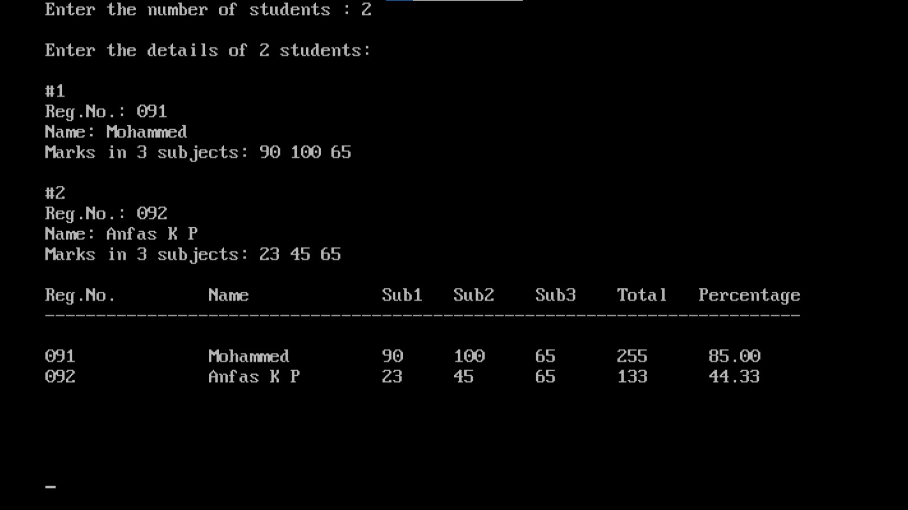

import { Tabs } from "nextra/components";

# Student Report Card

This program is designed to manage student data and generate a report card. It allows the user to input details for multiple students, including their registration number, name, and marks in three subjects. The program then calculates the total marks and percentage for each student and displays a formatted report of the results. This helps in organizing and presenting student performance data effectively.


### Code Breakdown

## Algorithm

1. **Start**
2. **Initialize Data Structures**:
   - Define a structure `student` with fields for registration number, name, and marks in three subjects.
   - Create an array `s` of type `student` to store data for multiple students.
3. **Input Number of Students**:
   - Read the number of students `n`.
4. **Input Student Details**:
   - For each student (from 1 to `n`):
     1. Prompt and read the student's registration number.
     2. Prompt and read the student's name.
     3. Prompt and read the marks in three subjects.
5. **Calculate and Display Results**:
   - Print the header for the report card.
   - For each student:
     1. Calculate the total marks as the sum of marks in three subjects.
     2. Calculate the percentage as the average of the total marks.
     3. Print the student's registration number, name, marks, total, and percentage in a formatted table.
6. **End**


## Code Explanation

<Tabs items={['In Depth', 'Clear code','Output']} defaultIndex="0">
  <Tabs.Tab>
```c filename="Detailed" copy showLineNumbers
#include <stdio.h>
#include <conio.h>

// Define a structure to store student details
struct student {
    char regno[15];  // Registration number of the student
    char name[25];   // Name of the student
    int m1, m2, m3;  // Marks in three subjects
};

void main() {
    // Array to store details of up to 10 students
    struct student s[10];
    int i, n;        // Loop counters and number of students
    int t;           // Total marks in three subjects
    float p;         // Percentage of total marks

    clrscr();        // Clear the screen

    // Input the number of students
    printf("Enter the number of students: ");
    scanf("%d", &n);

    // Input details for each student
    printf("\nEnter the details of %d students:\n", n);
    for (i = 0; i < n; i++) {
        printf("\n#%d\n", i + 1);
        printf("Reg.No.: ");
        scanf("%s", s[i].regno);  // Input registration number
        flushall();  // Clear input buffer
        printf("Name: ");
        gets(s[i].name);  // Input student's name
        printf("Marks in 3 subjects: ");
        scanf("%d%d%d", &s[i].m1, &s[i].m2, &s[i].m3);  // Input marks in 3 subjects
    }

    // Print the header for the report card
    printf("\nReg.No.\t\tName\t\t Sub1\tSub2\tSub3\tTotal\tPercentage");
    printf("\n--------------------------------------------------------------------------\n");

    // Calculate and print each student's total and percentage
    for (i = 0; i < n; i++) {
        t = s[i].m1 + s[i].m2 + s[i].m3;  // Calculate total marks
        p = t / 3.0;  // Calculate percentage
        printf("\n%-10.10s\t%-16.16s %d\t%d\t%d\t%d\t%6.2f", s[i].regno, s[i].name, s[i].m1, s[i].m2, s[i].m3, t, p);
    }

    printf("\n\n\n\n\n");
    getch();  // Wait for user input before closing
}

```
</Tabs.Tab>
<Tabs.Tab>
``` c filename="plain" copy showLineNumbers
#include <stdio.h>
#include <conio.h>

struct student {
    char regno[15];
    char name[25];
    int m1, m2, m3;
};

void main() {
    struct student s[10];
    int i, n, t;
    float p;

    clrscr();
    printf("Enter the number of students: ");
    scanf("%d", &n);

    printf("\nEnter the details of %d students:\n", n);
    for (i = 0; i < n; i++) {
        printf("\n#%d\n", i + 1);
        printf("Reg.No.: ");
        scanf("%s", s[i].regno);
        flushall();
        printf("Name: ");
        gets(s[i].name);
        printf("Marks in 3 subjects: ");
        scanf("%d%d%d", &s[i].m1, &s[i].m2, &s[i].m3);
    }

    printf("\nReg.No.\t\tName\t\t Sub1\tSub2\tSub3\tTotal\tPercentage");
    printf("\n--------------------------------------------------------------------------\n");

    for (i = 0; i < n; i++) {
        t = s[i].m1 + s[i].m2 + s[i].m3;
        p = t / 3.0;
        printf("\n%-10.10s\t%-16.16s %d\t%d\t%d\t%d\t%6.2f", s[i].regno, s[i].name, s[i].m1, s[i].m2, s[i].m3, t, p);
    }

    printf("\n\n\n\n\n");
    getch();
}

```
</Tabs.Tab>
<Tabs.Tab>
  
</Tabs.Tab>
</Tabs>

### Example Flowchart

```plaintext
                Start
                  |
                  V
Initialize `s[10]` (array of `student` structures)
                  |
                  V
      Read number of students `n`
                  |
                  V
    For each student (i from 0 to n-1):
                  |
                  |--- Read `regno` (Registration number)
                  |               |
                  |               V
                  |             Read `name` (Name)
                  |               |
                  |               V
                  |             Read marks `m1`, `m2`, and `m3` (Marks in 3 subjects)
                  |               |
                  |               V
                  |
                  V
      Print header for report card
                  |
                  V
                For each student (i from 0 to n-1):
                  |
                  |--- Calculate total `t = m1 + m2 + m3`
                  |                |
                  |                V
                  |              Calculate percentage `p = t / 3.0`
                  |                |
                  |                V
                  |              Print `regno`, `name`, `m1`, `m2`, `m3`, `t`, and `p`
                  |
                  V
                End

```
